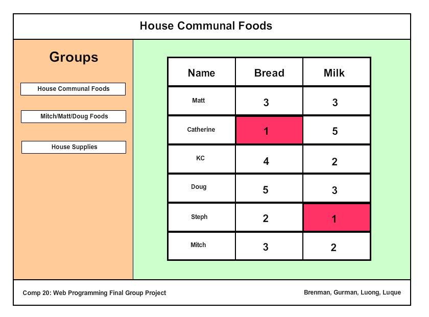
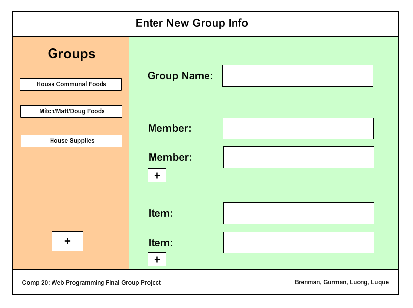

Comp 20 Group Project Proposal
==============================

Project title
- SharingIsCaring

Problem statement (i.e., what is the problem?)
- When sharing communal items between a group, keeping track of who needs to buy what can become an issue. Tracking how much is being spent over time and between people gives users an easy way to access this data from anywhere.

How do you solve the problem?
- Our product allows users to create groups (and be members of multiple groups) that keep track of the items that the group shares. Along with keeping track of the purchases, our product will notify a user when they are next on the list to purchase an item.

List of all the features that your team will implement (including which of the "Pick 5" items were chosen by the team). Your team will be held accountable for the features you list!
- Server-side data persistence (e.g., with PostgreSQL, MongoDB, MySQL)
- Front-end framework including Bootstrap, Backbone.js, AngularJS
- Reporting with charts and graphs
- Send emails and/or SMSes (e.g., Twilio)
- Geolocation

What data will your prototype be using and collecting
- The users in a certain group
- The items that they are communally sharing
- The type of these items
- The price of these items when purchased
- The number of items that are purchased
- The times that they are purchased
- The location that they are purchased

Any algorithms or special techniques that will be necessary
- Database analytics
- Allowing users to be part of multiple groups
- Possible facebook/twitter integration for logins
- Allow users to weight how much they should be spending on each item (ex. If one user uses may more milk, the group could be set up so that they need to buy twice as many. If they have 7 and the other members have 4, then the user with 7 still needs to buy the milk even though they have the most.)

Electronic mockups of what your team will be developing using wireframes. No hand-drawn mockups accepted.
-The main page

-Adding a new group

